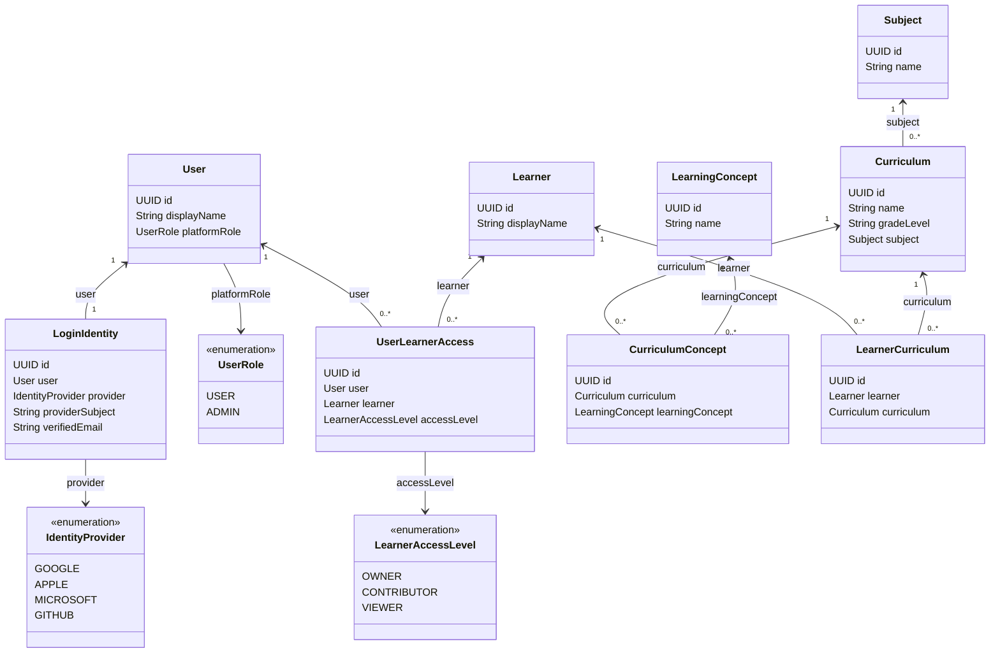

# Lumen — Domain Model

## Core modeling principle

Learning concepts are generic domain entities. Specific concepts such as Division, Fractions, or Multiplication are records/data instances, not separate code-level domain types.

## Canonical class diagram

This diagram is the canonical representation of the currently implemented core domain model and must be updated whenever a domain-model PR changes these classes or relationships.



## Agreed basic domain model

### User
Represents an authenticated adult using Lumen. Authentication-provider identities are modeled separately so product-domain behavior remains provider-neutral.

Platform role:
- `USER` — normal product user.
- `ADMIN` — platform administrator responsible for canonical product administration capabilities.

### LoginIdentity
Represents the one external OAuth/OIDC identity bound to one Lumen User in V1.

Identity rules:
- Identity is resolved by `(provider, providerSubject)`.
- `(provider, providerSubject)` must be unique.
- One LoginIdentity belongs to exactly one User.
- One User has exactly one LoginIdentity in V1.
- Matching email or display name across providers does not link or merge users.
- `verifiedEmail` is provider profile data and is not the identity key.

Supported provider values in the provider-neutral model are `GOOGLE`, `APPLE`, `MICROSOFT`, and `GITHUB`; concrete provider rollout is configured separately from domain semantics.

### UserLearnerAccess
Represents an adult user's access to a learner.

Relationship:
- One User may have access to many Learners.
- One Learner may be accessible by many Users.
- User and Learner are therefore many-to-many through UserLearnerAccess.
- A given User may have only one active access relationship for a given Learner.

Learner access levels:
- `OWNER` — full learner administration, including access management.
- `CONTRIBUTOR` — may update allowed learner academic configuration/content but not manage access or destructive lifecycle operations.
- `VIEWER` — read-only access.

### Subject
Represents a broad academic area such as Mathematics, Science, or English.

Relationship:
- One Subject has many Curricula.
- Each Curriculum belongs to one Subject.

### Curriculum
Represents a specific programme of study for one Subject, such as CBSE Grade 3 Mathematics or Olympiad Grade 3 Mathematics.

Relationship:
- One Curriculum has many CurriculumConcepts.
- Each CurriculumConcept belongs to one Curriculum.

### LearningConcept
Represents a canonical academic concept or skill independent of any particular curriculum.

Examples:
- Division
- Fractions
- Multiplication

LearningConcept exists independently of Curriculum.

### CurriculumConcept
Represents how a specific Curriculum includes a specific LearningConcept.

Relationship:
- Many CurriculumConcepts may reference the same LearningConcept.
- Each CurriculumConcept references exactly one LearningConcept.

This allows the same canonical concept (for example Fractions) to appear in multiple curricula with curriculum-specific expectations.

### Learner
Represents the child whose learning is being managed.

### LearnerCurriculum
Represents a learner following or being enrolled in a particular Curriculum.

Relationship:
- One Learner has many LearnerCurriculum records.
- One Curriculum has many LearnerCurriculum records.
- Each LearnerCurriculum belongs to one Learner and one Curriculum.
- Therefore Learner and Curriculum are many-to-many through LearnerCurriculum.

## Current relationship map

```text
LoginIdentity 1 -------- 1 User

User 1 --------< UserLearnerAccess >-------- 1 Learner

Subject 1 --------< Curriculum

Curriculum 1 -----< CurriculumConcept >----- 1 LearningConcept

Learner 1 --------< LearnerCurriculum >----- 1 Curriculum
```

Notes:
- `LoginIdentity -> User` is one-to-one in V1.
- `UserLearnerAccess -> User` is many-to-one.
- `UserLearnerAccess -> Learner` is many-to-one.
- `CurriculumConcept -> LearningConcept` is many-to-one.
- `Curriculum -> CurriculumConcept` is one-to-many.
- `Learner -> LearnerCurriculum` is one-to-many.
- `Curriculum -> LearnerCurriculum` is one-to-many.

## Important invariant

Do not create domain classes such as `Division`, `Fractions`, or `Multiplication`. These are instances of `LearningConcept`.

## Deferred modeling

The following areas are intentionally not finalized yet and will be modeled in later iterations:
- Evidence
- LearnerConceptState
- LearningGoal
- TimeBudget
- LearningPlan
- Diagnostic
- Recommendation / plan actions
- Concept relationships such as prerequisite, hierarchy, and sequencing

The exact learning-state scoring representation is also intentionally deferred.
